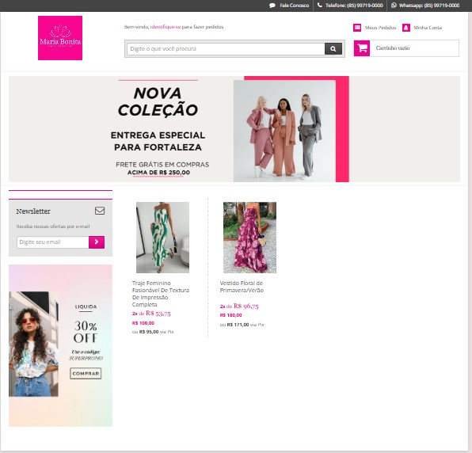
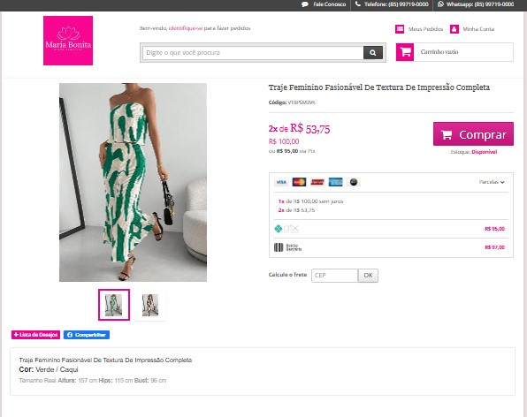

# 🛍️ Loja Virtual Maria Bonita

Este repositório apresenta o projeto **Loja Virtual Maria Bonita**, desenvolvido como parte da disciplina de **Gestão de E-commerce e Negócios Digitais** do curso de **Tecnologia em Logística** da Faculdade CDL.

O projeto tem como objetivo estruturar uma loja virtual de moda feminina, com foco em praticidade, atendimento humanizado e novidades constantes, oferecendo uma experiência diferenciada de compra online.

---

## 📸 Screenshots

### Página Inicial

### Página de Produto

---

## 📖 Sobre o Projeto

- **Nome comercial:** Maria Bonita  
- **Segmento:** Moda Feminina  
- **Link da loja:** [Maria Bonita - Loja Virtual](https://mariavirtualbonita.lojaintegrada.com.br/)  
- **Contato:** mariavirtualbonita@gmail.com  
- **WhatsApp Business:** (85) 99719-0000  

---

## 🎯 Missão
> "Oferecer roupas femininas modernas, confortáveis, que celebrem seu estilo único e autenticidade, proporcionando uma experiência de compra acessível e agradável."

---

## 🚀 Objetivos
- Consolidar a marca como referência em moda feminina online.  
- Atingir crescimento de **20% ao ano em vendas**.  
- Criar uma base sólida de **clientes fiéis** através de marketing de experiência.  

---

## 👩‍🎤 Público-Alvo (Persona)
**Ana, 30 anos**, profissional de marketing digital, mora em Fortaleza. Conectada e independente, valoriza praticidade, moda e tecnologia. Busca roupas modernas e versáteis, comprando com frequência em lojas virtuais e Instagram.

---

## 🛒 Mix de Produtos
- Blusas e croppeds  
- Body  
- Vestidos casuais  
- Shorts e calças  
- Acessórios (bolsas e bijuterias)  

---

## 📦 Operações Logísticas
- **Entregas:** Correios (PAC/SEDEX) e motoboy (Fortaleza e região).  
- **Frete grátis:** Compras acima de R$ 250,00.  
- **Pagamentos:** Cartão de crédito (até 3x sem juros), Pix (5% off), boleto (3% off), carteiras digitais (PayPal, Google Pay, Apple Pay).  

---

## 📊 Plano Financeiro
- **Custos fixos mensais:** R$ 1.620,00  
- **Receita prevista:** R$ 7.200,00/mês  
- **Margem bruta por peça:** 50%  
- **Ponto de equilíbrio:** R$ 3.521,74 em vendas/mês  

---

## 📢 Marketing Digital
- **Instagram:** postagens diárias, lives e interações.  
- **WhatsApp Business:** atendimento e catálogos exclusivos.  
- **Facebook:** reforço da presença online.  
- **E-mail Marketing:** newsletters mensais.  
- **Tráfego Pago:** anúncios segmentados (CTR, CPC, CPA).  

---

## 📌 Considerações Finais
A **Maria Bonita** nasce com o propósito de oferecer mais do que roupas: proporcionar uma **experiência de compra única, acolhedora e inspiradora**. O projeto combina logística, marketing digital e gestão financeira para estruturar um e-commerce competitivo e sustentável.

---

## 📂 Estrutura do Repositório
├── prints 
. . .├── paginaInicial.jpg # Screenshot da página inicial 
. . .├── paginaProduto.jpg # Screenshot da página de produto  
├── ApresentacaoProjeto.pptx # Apresentação do projeto  
├── ProjetoLojaVirtual.pdf # Documento completo do plano de negócios  
└── README.md # Este arquivo

## 📄 Licença
Este projeto foi desenvolvido como parte das atividades acadêmicas da Faculdade CDL.  
Uso educacional e não comercial.

---
